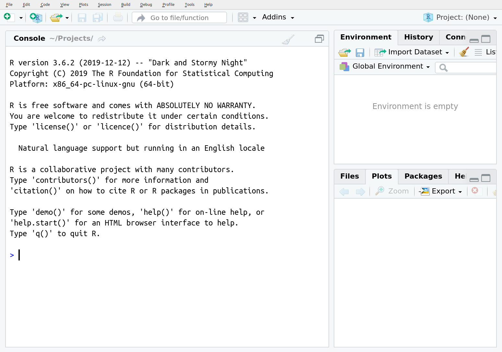

```{r, include = FALSE}
imgs <- c("../AA_Common/R.png", 
          "../AA_Common/RStudio-Ball.png", 
          "../AA_Common/rstudio_panes.png",
          "../AA_Common/A1_packages_edit.png")
file.copy(imgs, "./figures/", overwrite = TRUE)
```


<!-- 
title: Workshop Archive
This workshop has passed but this site will remain active for 1 year to give participants the chance to download material. -->

---

# Pre-Workshop Preparation

Welcome! I'm excited for the opportunity to share my love of R with you during this upcoming workshop. This site should give you all the details you need to get you ready to start on Saturday!

# Workshop Details

**Dates**: January 16th to 17th (Saturday and Sunday)    
**Time**: 9am - 5pm (Central)    
**Location**: Zoom  

  - Meeting ID: 915 8440 4956; Passcode: 057337
  - Link: <https://brandonu-ca.zoom.us/j/91584404956?pwd=QjFnY090VTZ2THRoUW1TRW4vT2FBdz09>

**Instructor**: Steffi LaZerte (<sel@steffilazerte.ca>)  
**Slides and Data:** Slides and data for the workshop are available [here](slides.html) 

>
> ### You will need a computer and Internet connection
>


# Before the Workshop
We are going to be covering a lot in our R sessions, so to give us a jump start, I've compiled some things you should have done before coming:

- Install R (Update R)
- Install RStudio (Update RStudio)
- Install `tidyverse` packages (Update `tidyverse` packages)
- Install a couple of extra packages

> **IMPORTANT!**:  
> If you have any problems installing the software or packages, 
> please contact me (sel@steffilazerte.ca) **BEFORE** the start of the workshop 
> so we can sort things out.


------------------------

## 1. Install R (Update R)

> Even if you already have R installed, **please update it**, so we're all working with the same version

Depending on your operating system, you can install R in one of the following ways:

__Windows__

- Go to the Windows download page: <https://cran.r-project.org/bin/windows/base/>
- Download and install R for windows (the link at the top)

__Mac__  

- Go to the Mac OS X download page: <https://cran.r-project.org/bin/macosx/>
- Download and install the version that matches your Mac OS X

__Linux: Debian/Ubuntu__

- Specific details: <https://cran.r-project.org/bin/linux/ubuntu/README.html>
- Add one of the CRAN repositories to you apt (otherwise your R will be out of date)

## 2. Install RStudio

> Even if you already have RStudio installed, **please update it**, so we're all working with the same version

- For all Operating systems (i.e., Windows, Mac Os, Linux, etc.) go to RStudio's download page:  <https://www.rstudio.com/products/rstudio/download/#download>
- Download and install the __installer__ that matches your system (i.e. select your link from the top options, not the Zip/Tarball options)

Open RStudio  **not R** . RStudio automatically opens R for you in the 'Console' pane

**Verify that your version of R by looking at the first line of the console, you should see something like this:**



The important line is the first one: `R version 4.0.3 (2020-10-10) -- "Bunny-Winnies Freak Out"`

## 3a) Install `tidyverse`

Packages are extensions or add-ons for R. You will use many different ones over the course of your work with R. `tidyverse` is name of a collection of newer packages for data management.

In RStudio:

- Click on the 'Packages' tab in the lower right hand corner
- Click on the 'Install' button right below the tab
- Type 'tidyverse' into the 'Packages' box, and click on 'Install'


- This may take a while (you will see lots of download text in red in your console)
- When it's finished, you should see a message similar this one to in the console (lower left hand pane)

```
* DONE (tidyverse)

The downloaded source packages are in
	‘/tmp/RtmpACWq9S/downloaded_packages’
> 
```

- Test that your installation had no problems by typing `library(tidyverse)` into the console and hitting enter. You should see something like this (**Note:** These are messages, not errors!):

```{r, messages = TRUE}
library(tidyverse)
```

> ### Problems?
> - If you already had R/RStudio installed, try removing them both and installing everything from scratch
> - If you get an error about a problem installing a specific package, try installing that package invidiually (search for it in the install packages menu)
> - Try installing the packages we need by hand: `dplyr`, `tidyr`, `readr`, `ggplot2`
> - [Contact Steffi](mailto:sel@steffilazerte.ca)


## 3b) Update `tidyverse`

**This is only necessary if you have an older version of `tidyverse` installed.**

In RStudio:    

- Click on on the 'Update' button next to the 'Install' button
- Click on 'Select All' button
- Click on 'Install Updates' button
- **Repeat** until there are no new updates

## 4. Install some other packages

We'll also be using a couple of other packages that are not included in the `tidyverse` so let's make sure you have them installed too, either by using the same installation menu as above or the following code:

```{r, eval = FALSE}
install.packages(c("palmerpenguins", "skimr", "patchwork", "janitor", "readxl"))
```


__Congratulations! Now you're ready to get into the fun stuff :)__
